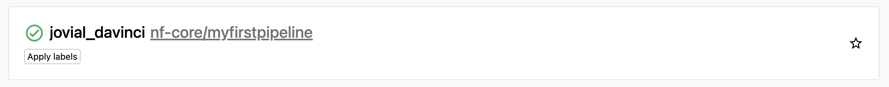

https://training.nextflow.io/hello_nextflow/10_hello_seqera/

How did I not know this tip? 
Keep your token secure and do not share it with others. Add a Space before the export command above to prevent your token from being saved in your shell history.

 export TOWER_ACCESS_TOKEN=<SEE 1Password Seqera Platform Personal Access Token PAT>
^
Space here! Otherwise you should be dd'ing the $HISTFILE

Now let's run hello world with the platform:

    nextflow run nextflow-io/hello -with-tower

Oddly this seems to name the pipeline link after the working directory rather than the pipeline defined.

TODO Shouldn't this have been nf-core/hello? As per the image in the tutorial docs?
This is likely because nextflow was picking up some of the config files in the `nf-core-myfirstpipeline` directory. This is being picked up from the manifest.name config. So even if we run a completely different pipeline, if we run it in a pipeline directory, that config will seemingly override the config of the remote pipeline?! https://www.nextflow.io/docs/latest/config.html#configuration-file

Specify the env var can become tedious so let's store it as a secret instead!

    nextflow secrets set tower_access_token "$TOWER_ACCESS_TOKEN"
    nextflow secrets get tower_access_token

And set up nestflox user config:

    $HOME/.nextflow/config

    tower {
        enabled = true
        endpoint = "https://api.cloud.seqera.io"
        accessToken = secrets.tower_access_token
    }

TODO This isn't mentioned in the tutorial so may still be using the env var?
    unset TOWER_ACCESS_TOKEN

The above `--with-tower` runs have actually executed locally, and only sent logs to the platform for monitoring.

Skipping the bit on running nf-core-rnaseq in the platform as I've already done that.

That's the end of the 'hello' training.

Next step is first part of the 'fundamentals training.

TODO Would be nice to know how to trigger a run on the platform via the cmdline. tower/seqerakit CLIs?